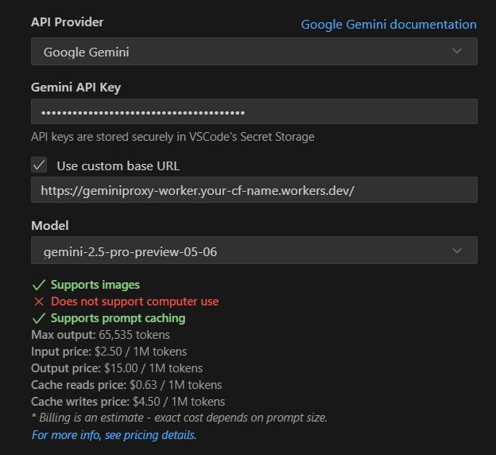

[Tiếng Việt](README.md) | [English](README.en.md)

# Gemini API Proxy Worker for Cloudflare

This project is for those using Gemini free in Cline who need to constantly change API keys due to rate limits. It creates a relay server between your machine and Google Gemini endpoint, containing a list of your API keys that automatically rotates them in round-robin fashion.

This is a TypeScript conversion of the original Go-based `geminiproxy` project, adapted to run on Cloudflare's serverless edge network. If you prefer Go or want to deploy via Docker, you can use the original project.

## Repository

This project is hosted at: https://github.com/vnt87/gemini-proxy-worker.git

## Features

-   Proxies requests to the Gemini API (`generativelanguage.googleapis.com`).
-   Automatically rotates through multiple Gemini API keys in a round-robin fashion.
-   API keys are stored securely in Cloudflare KV.
-   Stateless architecture suitable for Cloudflare Workers.
-   Transparent to clients – they make requests to the Worker URL as if it were the Gemini API (after initial setup).
-   LiteLLM compatibility (removes `Authorization` header).
-   Compatible with go-genai client libraries.

## Prerequisites

-   A Cloudflare account.
-   `npm` and `Node.js` installed.
-   Wrangler CLI installed (`npm install -g wrangler`).
-   One or more Gemini API keys.

## Setup

1.  **Clone the Repository**:
    ```bash
    git clone https://github.com/vnt87/gemini-proxy-worker.git
    cd gemini-proxy-worker
    ```
    *(If you are initializing this project from existing local files and want to connect to this remote, use `git remote add origin https://github.com/vnt87/gemini-proxy-worker.git` after `git init`)*

2.  **Install Dependencies:**
    ```bash
    npm install
    ```

3.  **Create KV Namespace:**
    In your terminal, run:
    ```bash
    wrangler kv:namespace create GEMINI_KEYS
    ```
    This command will output an `id`. Note this ID.

4.  **Configure `wrangler.toml`:**
    Open `wrangler.toml` and update the `kv_namespaces` section with the `id` you obtained:
    ```toml
    kv_namespaces = [
      { binding = "GEMINI_KEYS", id = "YOUR_ACTUAL_KV_NAMESPACE_ID" }
    ]
    ```

5.  **Prepare and Upload API Keys:**
    a.  Create a JSON file named `gemini-keys.json` (or use `gemini-keys.json.example` as a template) in the `geminiproxy-worker` directory. It should contain your Gemini API keys:
        ```json
        // gemini-keys.json
        [
          {
            "key": "key_0",
            "value": "AIzaSyA...key1"
          },
          {
            "key": "key_1",
            "value": "AIzaSyB...key2"
          },
          {
            "key": "key_2",
            "value": "AIzaSyC...key3"
          }
        ]
        ```
        **Important:** Ensure `gemini-keys.json` is listed in your `.gitignore` file to prevent committing your actual keys. A `gemini-keys.json.example` is provided.

    b.  Upload this file to your KV namespace. The key manager expects the keys to be stored under the KV key `GEMINI_API_KEYS_CONFIG`.
        ```bash
        wrangler kv:key put --binding=GEMINI_KEYS "GEMINI_API_KEYS_CONFIG" --path="./gemini-keys.json"
        ```
        *Note: Ensure `wrangler.toml` is correctly configured with the `GEMINI_KEYS` binding before running this.*

### Updating Keys

When you need to update keys, first update the _**gemini-keys.json**_ file, then run either _**update-keys.sh**_ (Linux/Mac) or _**update-keys.bat**_ (Windows).

These scripts will:
- Check for required configuration files
- Copy from .example files if originals don't exist
- Validate JSON structure
- Execute Wrangler KV bulk put command (no conversion needed)

For first-time setup, you may need to manually edit the copied files before running the scripts.

## Using with Roo Code or Cline

To configure the URL endpoint in Roo Code:
1. Open Roo Code settings
2. Check 'Use custom base URL'
3. Set the endpoint to your Cloudflare Worker URL (e.g., `https://geminiproxy-worker.<your-subdomain>.workers.dev`)
4. Save settings

(You can leave the Gemini API Key field empty - our endpoint already has the API keys integrated)



## Usage

### Local Development

To test the Worker locally:
```bash
wrangler dev
```
This will start a local server (typically `http://localhost:8787`). You can send requests to this endpoint as if it were the Gemini API. For example, if the Gemini API endpoint is `https://generativelanguage.googleapis.com/v1beta/models/gemini-pro:generateContent`, you would send your request to `http://localhost:8787/v1beta/models/gemini-pro:generateContent`.

The Worker will append the rotated API key to the request.

### Deployment

To deploy the Worker to your Cloudflare account:
```bash
wrangler deploy
```
After deployment, Wrangler will provide you with the URL of your deployed Worker (e.g., `https://geminiproxy-worker.<your-subdomain>.workers.dev`). Use this URL as your Gemini API endpoint in your client applications.

## Debugging

To view real-time logs from your deployed worker:
```bash
npx wrangler tail
```
This will stream logs from your production worker, showing:
- Requests and responses
- Errors
- Key rotation events
- KV store operations

Press Ctrl+C to stop the log stream.

## How It Works

1.  A client sends a request to the Cloudflare Worker URL.
2.  The Worker's `fetch` handler receives the request.
3.  The `KeyManager` retrieves the list of API keys and the current rotation index from the `GEMINI_KEYS` KV namespace.
4.  It selects the next API key in a round-robin fashion and updates the index in KV for the next request.
5.  The Worker forwards the original request to the actual Gemini API endpoint (`https://generativelanguage.googleapis.com`), appending the selected API key as a query parameter.
6.  The response from the Gemini API is streamed back to the client through the Worker.

## Contributing

Contributions are welcome! Please open an issue or submit a pull request for any bugs, features, or improvements.

## License

MIT
