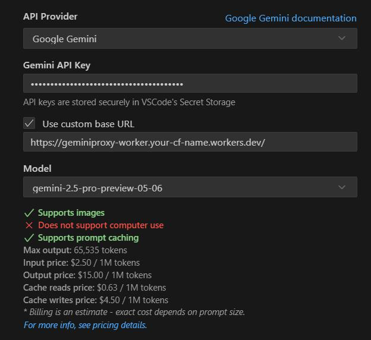

[Tiếng Việt](README.md) | [English](README.en.md)

# Gemini API Proxy Worker cho Cloudflare

Dự án này triển khai một Cloudflare Worker hoạt động như một reverse proxy cho Gemini API của Google. Nó cung cấp tính năng tự động xoay vòng API key sử dụng Cloudflare KV store để lưu trữ.

Đây là phiên bản chuyển đổi từ TypeScript của dự án `geminiproxy` gốc dựa trên Go, được điều chỉnh để chạy trên mạng lưới edge serverless của Cloudflare.

## Repository (Kho Mã Nguồn)

Dự án này được lưu trữ tại: https://github.com/vnt87/gemini-proxy-worker.git

## Features (Tính Năng)

-   Proxy các yêu cầu đến Gemini API (`generativelanguage.googleapis.com`).
-   Tự động xoay vòng qua nhiều API key của Gemini theo kiểu round-robin.
-   API key được lưu trữ an toàn trong Cloudflare KV.
-   Kiến trúc stateless phù hợp với Cloudflare Workers.
-   Minh bạch với client – client gửi yêu cầu đến URL của Worker như thể đó là Gemini API (sau khi thiết lập ban đầu).
-   Tương thích với LiteLLM (loại bỏ header `Authorization`).

## Prerequisites (Điều Kiện Tiên Quyết)

-   Một tài khoản Cloudflare.
-   Đã cài đặt `npm` và `Node.js`.
-   Đã cài đặt Wrangler CLI (`npm install -g wrangler`).
-   Một hoặc nhiều API key của Gemini.

## Setup (Cài Đặt)

1.  **Clone Repository (Sao Chép Kho Mã Nguồn)**:
    ```bash
    git clone https://github.com/vnt87/gemini-proxy-worker.git
    cd gemini-proxy-worker
    ```
    *(Nếu bạn đang khởi tạo dự án này từ các tệp cục bộ hiện có và muốn kết nối với kho mã nguồn từ xa này, hãy sử dụng `git remote add origin https://github.com/vnt87/gemini-proxy-worker.git` sau khi `git init`)*

2.  **Install Dependencies (Cài Đặt Các Gói Phụ Thuộc):**
    ```bash
    npm install
    ```

3.  **Create KV Namespace (Tạo Namespace KV):**
    Trong terminal của bạn, chạy lệnh:
    ```bash
    wrangler kv:namespace create GEMINI_KEYS
    ```
    Lệnh này sẽ xuất ra một `id`. Ghi lại ID này.

4.  **Configure `wrangler.toml` (Cấu Hình `wrangler.toml`):**
    Mở tệp `wrangler.toml` và cập nhật phần `kv_namespaces` với `id` bạn đã nhận được:
    ```toml
    kv_namespaces = [
      { binding = "GEMINI_KEYS", id = "YOUR_ACTUAL_KV_NAMESPACE_ID" } # Thay YOUR_ACTUAL_KV_NAMESPACE_ID bằng ID thực tế của bạn
    ]
    ```

5.  **Prepare and Upload API Keys (Chuẩn Bị và Tải Lên API Keys):**
    a.  Tạo một tệp JSON có tên `gemini-keys.json` (hoặc sử dụng `gemini-keys.json.example` làm mẫu) trong thư mục `geminiproxy-worker`. Tệp này nên chứa các API key Gemini của bạn:
        ```json
        // gemini-keys.json
        [
          {
            "key": "key_0",
            "value": "AIzaSyA...key1"
          },
          {
            "key": "key_1",
            "value": "AIzaSyB...key2"
          },
          {
            "key": "key_2",
            "value": "AIzaSyC...key3"
          }
        ]
        ```
        **Quan trọng:** Đảm bảo `gemini-keys.json` được liệt kê trong tệp `.gitignore` của bạn để tránh commit các key thực tế. Một tệp `gemini-keys.json.example` được cung cấp.

    b.  Tải tệp này lên namespace KV của bạn. Trình quản lý key mong đợi các key được lưu trữ dưới key KV `GEMINI_API_KEYS_CONFIG`.
        ```bash
        wrangler kv:key put --binding=GEMINI_KEYS "GEMINI_API_KEYS_CONFIG" --path="./gemini-keys.json"
        ```
        *Lưu ý: Đảm bảo `wrangler.toml` được cấu hình chính xác với binding `GEMINI_KEYS` trước khi chạy lệnh này.*

### Script Quản Lý Key

Chúng tôi cung cấp các script để đơn giản hóa việc quản lý key:

1. **update-keys.sh** (Linux/Mac):
   ```bash
   ./update-keys.sh
   ```
   Yêu cầu: cài đặt jq (`brew install jq` hoặc `sudo apt-get install jq`)

2. **update-keys.bat** (Windows):
   ```cmd
   update-keys.bat
   ```
   Yêu cầu: cài đặt jq cho Windows

Các script này sẽ:
- Kiểm tra các file cấu hình cần thiết
- Sao chép từ file .example nếu file gốc không tồn tại
- Kiểm tra cấu trúc JSON
- Thực thi lệnh Wrangler KV bulk put (không cần chuyển đổi)

Với lần cài đặt đầu tiên, bạn có thể cần chỉnh sửa thủ công các file đã sao chép trước khi chạy script.

## Cấu Hình Roo Code

Để cấu hình URL endpoint trong Roo Code:
1. Mở cài đặt Roo Code
2. Điều hướng đến phần cấu hình API
3. Đặt endpoint thành URL Cloudflare Worker của bạn (ví dụ: `https://geminiproxy-worker.<your-subdomain>.workers.dev`)
4. Lưu cài đặt



## Usage (Sử Dụng)

### Local Development (Phát Triển Cục Bộ)

Để kiểm tra Worker cục bộ:
```bash
wrangler dev
```
Lệnh này sẽ khởi động một máy chủ cục bộ (thường là `http://localhost:8787`). Bạn có thể gửi yêu cầu đến điểm cuối này như thể đó là Gemini API. Ví dụ, nếu điểm cuối Gemini API là `https://generativelanguage.googleapis.com/v1beta/models/gemini-pro:generateContent`, bạn sẽ gửi yêu cầu của mình đến `http://localhost:8787/v1beta/models/gemini-pro:generateContent`.

Worker sẽ nối thêm API key được xoay vòng vào yêu cầu.

### Deployment (Triển Khai)

Để triển khai Worker lên tài khoản Cloudflare của bạn:
```bash
wrangler deploy
```
Sau khi triển khai, Wrangler sẽ cung cấp cho bạn URL của Worker đã triển khai (ví dụ: `https://geminiproxy-worker.<your-subdomain>.workers.dev`). Sử dụng URL này làm điểm cuối Gemini API trong các ứng dụng client của bạn.

## Debugging (Gỡ Lỗi)

Để xem log thời gian thực từ worker đã triển khai của bạn:
```bash
npx wrangler tail
```
Lệnh này sẽ truyền log từ worker sản xuất của bạn, hiển thị:
- Yêu cầu và phản hồi
- Lỗi
- Sự kiện xoay vòng key
- Hoạt động lưu trữ KV

Nhấn Ctrl+C để dừng luồng log.

## How It Works (Cách Hoạt Động)

1.  Một client gửi yêu cầu đến URL của Cloudflare Worker.
2.  Trình xử lý `fetch` của Worker nhận yêu cầu.
3.  `KeyManager` truy xuất danh sách các API key và chỉ mục xoay vòng hiện tại từ namespace `GEMINI_KEYS` KV.
4.  Nó chọn API key tiếp theo theo kiểu round-robin và cập nhật chỉ mục trong KV cho yêu cầu tiếp theo.
5.  Worker chuyển tiếp yêu cầu gốc đến điểm cuối Gemini API thực tế (`https://generativelanguage.googleapis.com`), nối thêm API key đã chọn làm tham số truy vấn.
6.  Phản hồi từ Gemini API được truyền trực tiếp trở lại client thông qua Worker.

## Contributing (Đóng Góp)

Chúng tôi hoan nghênh các đóng góp! Vui lòng mở một issue hoặc gửi một pull request cho bất kỳ lỗi, tính năng hoặc cải tiến nào.

## License (Giấy Phép)

MIT
